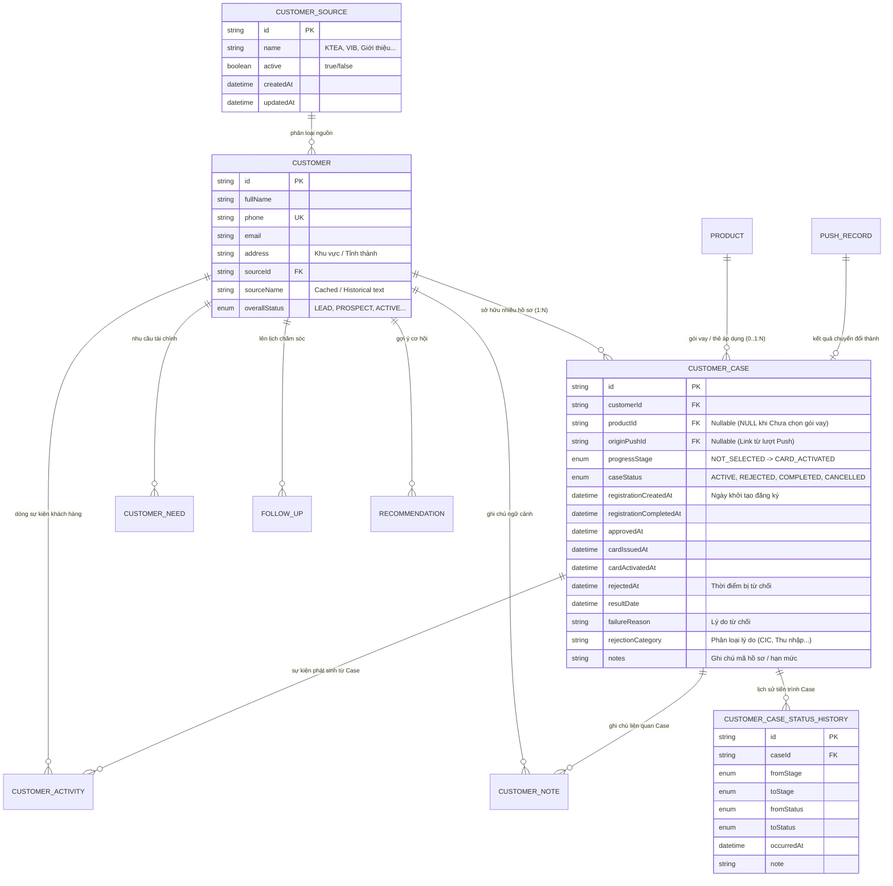

# KTEA CRM & CUSTOMER INTELLIGENCE SYSTEM
## BẢN ĐẶC TẢ YÊU CẦU NGHIỆP VỤ & KỸ THUẬT (BRD - SRS V2)
**Hệ thống Quản lý & Trí tuệ Khách hàng Cho Đơn vị Vận hành Đơn lẻ**  
**Tài liệu chuẩn - Source of Truth Hoàn Thiện cho Toàn Bộ Dự Án**  
*Ngày cập nhật: 04/10/2026 | Phiên bản: 2.2.0-FINAL-LOCKED-SPEC*

---

> [!IMPORTANT]
> **NGUYÊN TẮC BẤT BIẾN CỦA HỆ THỐNG (CORE CONSTRAINTS)**
> 1. **Mô hình Vận hành Đơn lẻ (Single-Operator Focus):** Hệ thống phục vụ duy nhất 01 nhân viên vận hành nghiệp vụ. Triệt để KHÔNG xây dựng phân quyền nhiều cấp (RBAC), multi-tenancy, authentication phức tạp, hierarchy hay phân chia vai trò người dùng.
> 2. **Bảo tồn Dữ liệu & Tính toàn vẹn Lịch sử (Immutable Historical Integrity):** Tuyệt đối không ghi đè lịch sử khi trạng thái thay đổi. Phân biệt rõ thời điểm hệ thống ghi nhận (`createdAt`) và mốc thời gian nghiệp vụ thực tế phát sinh (`business timestamps`).
> 3. **Một Khách Hàng - Nhiều Hồ Sơ Độc Lập (1 Customer → Many Cases):** Mỗi hồ sơ (`CustomerCase`) đại diện cho một lần đăng ký độc lập. Không ghi đè Case cũ, không tái sử dụng Case đã bị từ chối.
> 4. **Tránh Over-Engineering:** Tối ưu sự đơn giản, tin cậy, nhất quán và hiệu năng cao. Không sử dụng Kafka, microservices, AI/ML blackbox trong giai đoạn hiện tại. Mọi phân tích dữ liệu đều được bảo đảm bằng Data Model và Event History chuẩn xác.

---

## MỤC LỤC CHI TIẾT

1. [Executive Summary](#1-executive-summary)
2. [Business Objective](#2-business-objective)
3. [Business Decisions Confirmed (7 Quyết định Nghiệp vụ Đã Chốt)](#3-business-decisions-confirmed)
4. [Current System Audit](#4-current-system-audit)
5. [Current Architecture](#5-current-architecture)
6. [Domain Model & ERD Concept](#6-domain-model--erd-concept)
7. [Customer Management Requirements](#7-customer-management-requirements)
8. [Customer Source Domain & Extensibility](#8-customer-source-domain--extensibility)
9. [Customer Case Requirements (1:N & Optional Product)](#9-customer-case-requirements-1n--optional-product)
10. [Application Progress Workflow & Status Model](#10-application-progress-workflow--status-model)
11. [Address & Notes Requirements](#11-address--notes-requirements)
12. [Timeline & Case History Requirements](#12-timeline--case-history-requirements)
13. [Follow-up Requirements](#13-follow-up-requirements)
14. [Push Customer Workflow](#14-push-customer-workflow)
15. [Recommendation Foundation](#15-recommendation-foundation)
16. [Analytics Foundation (Customer vs Case Metrics)](#16-analytics-foundation-customer-vs-case-metrics)
17. [Data Model Proposal](#17-data-model-proposal)
18. [Existing Schema vs Proposed Schema](#18-existing-schema-vs-proposed-schema)
19. [API Requirements](#19-api-requirements)
20. [Frontend/UI Requirements](#20-frontendui-requirements)
21. [Dashboard Requirements](#21-dashboard-requirements)
22. [Validation Rules](#22-validation-rules)
23. [Data Integrity Rules](#23-data-integrity-rules)
24. [Future Extension Points](#24-future-extension-points)
25. [Migration Strategy](#25-migration-strategy)
26. [Implementation Phases](#26-implementation-phases)
27. [Risks & Trade-offs](#27-risks--trade-offs)
28. [Open Questions & Business Confirmations](#28-open-questions--business-confirmations)
29. [Final Recommended Architecture](#29-final-recommended-architecture)
30. [Acceptance Criteria](#30-acceptance-criteria)

---

## 1. Executive Summary

Hệ thống **KTEA CRM / Customer Intelligence System** là nền tảng quản lý quan hệ khách hàng và phân tích dữ liệu chuyên biệt, được thiết kế chuyên sâu cho **duy nhất một nhân viên vận hành**. 

Hệ thống số hóa toàn bộ quy trình chăm sóc, thẩm định và khai thác khách hàng theo chu trình khép kín:

```
CUSTOMER (Khách hàng định danh duy nhất)
    ↓
CUSTOMER DATA (Nguồn động KTEA/VIB/..., Địa chỉ chuẩn, Ghi chú định tính)
    ↓
CUSTOMER CASE [1:N] (Nhiều hồ sơ độc lập qua các thời kỳ)
    ↓
CASE PROGRESS PIPELINE (Chưa chọn gói vay → Khởi tạo → Hoàn tất → Thẩm định → Duyệt → Phát hành → Kích hoạt)
    ↓
PUSH / FOLLOW-UP (Chuyển khách chuyên viên & Lịch chăm sóc định kỳ)
    ↓
RESULT OUTCOME (Đạt mốc ACTIVATED/COMPLETED HOẶC REJECTED/CLOSED)
    ↓
ANALYTICS (Tách bạch Customer Count vs Case Count, Cycle Time, Funnel Nguồn KTEA vs VIB)
    ↓
FUTURE INTELLIGENCE / RECOMMENDATION (Scoring & Gợi ý sản phẩm mở rộng)
```

Tài liệu này là **Source of Truth hoàn thiện** cập nhật toàn bộ 7 quyết định nghiệp vụ đã được khách hàng phê duyệt chính thức.

---

## 2. Business Objective

1. **Quản lý Tập trung 360°:** Khắc phục triệt để tình trạng thất lạc thông tin khách hàng, số điện thoại, kênh tiếp cận và ghi chú tương tác.
2. **Quản lý Đa Hồ sơ Độc lập (Multi-Case Lifecycle):** Một khách hàng có thể đăng ký nhiều lần, nhiều gói vay/thẻ qua các giai đoạn khác nhau mà không bao giờ bị ghi đè dữ liệu.
3. **Linh hoạt Ban đầu (Deferred Product Assignment):** Cho phép tạo hồ sơ ngay khi tiếp nhận khách ở trạng thái "Chưa chọn gói vay" (`NOT_SELECTED`), sau đó nhân viên mới chọn sản phẩm phù hợp.
4. **Đóng Hồ sơ Từ chối Bất biến (Permanent Rejection Closure):** Hồ sơ bị từ chối sẽ đóng vĩnh viễn (`REJECTED / CLOSED`). Khách làm lại sẽ mở một hồ sơ hoàn toàn mới.
5. **Nguồn Khách Hàng Động (Extensible Source Registry):** Mặc định ban đầu **KTEA**, **VIB**, nhưng nhân viên có thể bổ sung nguồn mới (Facebook, Giới thiệu, Khách cũ...) và quản lý kích hoạt mà không làm sai lệch lịch sử.
6. **Chuẩn hóa Địa chỉ & Ghi chú (Address vs Notes):** Tách bạch địa chỉ hành chính phục vụ phân tích vùng miền với các ghi chú định tính về ngữ cảnh sinh hoạt của khách.
7. **Nền tảng Phân tích Chuẩn xác (Analytics Foundation):** Phân biệt rạch ròi giữa số lượng khách hàng (`Customer count`) và số lượng hồ sơ (`Case count`), đo lường tỷ lệ duyệt, tỷ lệ kích hoạt theo từng nguồn.

---

## 3. Business Decisions Confirmed

Dưới đây là **7 Quyết định Nghiệp vụ Cốt lõi** đã được khách hàng và nhóm vận hành **chốt chính thức**:

### 1. One Customer → Many Cases (Một Khách Hàng Có Thể Có Nhiều Hồ Sơ Đăng Ký)
- Quan hệ giữa `Customer` và `CustomerCase` là **1 - N (Một - Nhiều)**.
- `CustomerCase` đại diện cho **MỘT LẦN ĐĂNG KÝ / MỘT HỒ SƠ ĐỘC LẬP**.
- Ví dụ thực tế:
  ```
  Customer A
  │
  ├── Case #001 (01/2026): Vay tiêu dùng gói A  → KẾT QUẢ: REJECTED (Đã đóng)
  ├── Case #002 (05/2026): Vay mua ô tô gói B   → KẾT QUẢ: REJECTED (Đã đóng)
  └── Case #003 (10/2026): Mở thẻ tín dụng VIB  → KẾT QUẢ: CARD_ACTIVATED / COMPLETED
  ```
- **Nguyên tắc kỹ thuật:**
  - Không bao giờ được overwrite Case cũ.
  - Không bao giờ biến Case cũ thành Case mới.
  - Mọi Case phải giữ lịch sử riêng biệt, nguyên vẹn vĩnh viễn.

### 2. New Case May Start Without Product (Case Mới Có Thể Chưa Chọn Gói Vay)
- Khi nhân viên tạo `CustomerCase` mới, **KHÔNG bắt buộc phải chọn Product ngay**.
- Hồ sơ mới bắt đầu tại bước: **`NOT_SELECTED` ("Chưa chọn gói vay")** với `productId = NULL`.
- Sau khi nhân viên tư vấn và xác định gói vay phù hợp, nhân viên gán Product cho Case và hồ sơ bước vào giai đoạn `REGISTRATION_CREATED` ("Khởi tạo đăng ký").
- Vòng đời tiến trình chuẩn:
  ```
  Customer
      ↓
  Create Case
      ↓
  NOT_SELECTED (productId = NULL)
      ↓ Chọn gói vay (productId được gán)
  REGISTRATION_CREATED
      ↓ Thu thập đủ hồ sơ
  REGISTRATION_COMPLETED
      ↓ Gửi ngân hàng xét duyệt
  UNDER_REVIEW
      ↓ Thẩm định duyệt
  APPROVED
      ↓ Dập & xuất thẻ
  CARD_ISSUED
      ↓ Khách kích hoạt thành công
  CARD_ACTIVATED
      ↓ Hoàn tất toàn bộ chu trình
  COMPLETED
  ```

### 3. Rejected Case is Permanently Closed (Hồ Sơ Bị Từ Chối Sẽ Đóng Lại Vĩnh Viễn)
- Một Case khi bị từ chối thẩm định sẽ được coi là:
  - **`caseStatus = REJECTED`**
  - **`isClosed = true` (Trạng thái đóng)**
- **Không tiếp tục lifecycle** của Case đó nữa.
- **Không reset** Case cũ về bước đầu.
- **Không chuyển lại** sang `ACTIVE` hay `IN_PROGRESS`.
- **Không chuyển lại** sang `NOT_SELECTED`.
- Toàn bộ lịch sử xử lý, ngày từ chối (`rejectedAt`), lý do từ chối (`failureReason`, `rejectionCategory`) và ghi chú (`notes`) được lưu giữ nguyên vẹn trên Case đó.

### 4. Re-registration Creates a New Case (Đăng Ký Lại Sẽ Tạo Case Mới)
- Nếu một khách hàng có hồ sơ bị từ chối nhưng sau đó muốn nộp lại phương án khác hoặc đăng ký sản phẩm khác:
  - **TUYỆT ĐỐI KHÔNG REUSE CASE CŨ**.
  - Nhân viên bấm tạo **CustomerCase MỚI** (sinh `UUID` mới).
  - Case mới bắt đầu lại từ đầu: `productId = NULL`, tiến trình `NOT_SELECTED`.
  - Case cũ vẫn nằm trong danh mục lịch sử của khách hàng để phục vụ tra cứu và kiểm toán.

### 5. Customer Sources Have Default Values But Can Be Extended (Nguồn Khách Hàng Có Giá Trị Mặc Định Nhưng Cho Phép Mở Rộng Linh Hoạt)
- Giá trị mặc định ban đầu: **KTEA**, **VIB**.
- Nhân viên vận hành duy nhất được phép tự do bổ sung các nguồn mới trực tiếp trên giao diện (ví dụ: `Giới thiệu`, `Facebook`, `Khách cũ`, `Zalo`, `Sự kiện`...).
- **Không hard-code** nguồn khách hàng thành một `enum` tĩnh trong database.
- Xây dựng bảng danh mục `CustomerSource` (`id`, `name`, `active`, `createdAt`, `updatedAt`).
- **Hành vi khi Deactivate Nguồn:**
  - Nguồn bị tắt kích hoạt (`active = false`) sẽ không xuất hiện trong dropdown lựa chọn khi thêm/sửa khách hàng mới.
  - Toàn bộ khách hàng cũ đã thuộc nguồn đó vẫn giữ nguyên liên kết nguồn, không bị mất lịch sử.
  - Không cho phép xóa cứng (`Hard Delete`) nguồn nếu đã có khách hàng tham chiếu.

### 6. Historical Data Must Never Be Overwritten (Bảo Toàn Tuyệt Đối Dữ Liệu Lịch Sử)
- Các mốc thời gian nghiệp vụ (`registrationCreatedAt`, `registrationCompletedAt`, `approvedAt`, `cardIssuedAt`, `cardActivatedAt`, `rejectedAt`) được phân định rạch ròi với thời điểm hệ thống ghi nhận (`createdAt`, `updatedAt`).
- Bảng lịch sử tiến trình `CustomerCaseStatusHistory` và bảng dòng hoạt động `CustomerActivity` là **APPEND-ONLY** (chỉ thêm mới, không sửa/xóa).

### 7. Analytics Must Distinguish Customer Metrics From Case Metrics (Phân Biệt Bắt Buộc: Chỉ Số Khách Hàng vs Chỉ Số Hồ Sơ)
- Vì một khách hàng có thể có nhiều Case, hệ thống phân tích tuyệt đối không được đánh đồng 135 hồ sơ thành 135 khách hàng.
- Báo cáo phải tách bạch:
  - **Chỉ số Khách hàng (Customer-level):** `Customer count`, `Active Customer count`, `Customer Conversion Rate`.
  - **Chỉ số Hồ sơ (Case-level):** `Total Cases`, `Approved Cases`, `Rejected Cases`, `Activated Cases`.
  - **Phân tích Phễu Nguồn (Source Funnel):** Đo lường chi tiết hiệu quả của từng nguồn:
    `Source → Unique Customers → Total Cases → Approved Cases → Activated Cases`.

---

## 4. Current System Audit

Qua việc kiểm tra trực tiếp mã nguồn thực tế tại backend và frontend:

### 4.1. Cơ sở Dữ liệu Hiện tại (`backend/prisma/schema.prisma`)
- Bảng `customers` có `source String? @map("source")`, `address String?`, `phone`, `email`.
- Bảng `customer_cases` hiện tại:
  - `productId String` hiện tại là **bắt buộc** (`onDelete: Restrict`). Điều này không cho phép tạo Case ở trạng thái "Chưa chọn gói vay" (`NOT_SELECTED`). Cần chuyển thành `productId String?` (nullable).
  - `caseStatus` hiện chỉ có enum thẩm định: `DRAFT`, `SUBMITTED`, `UNDER_REVIEW`, `APPROVED`, `REJECTED`, `CANCELLED`.
  - Chưa có trường `progressStage` cho chu trình 7 bước nghiệp vụ.
  - Chưa có bảng lưu vết lịch sử tiến trình cho từng Case (`CustomerCaseStatusHistory`).

### 4.2. Giao diện Người dùng Hiện tại
- `CustomersPage.tsx` đang hiển thị badge `priority`, chưa hiển thị nguồn khách hàng và chưa có bộ lọc nguồn.
- `CustomerDetailPage.tsx` tab "Hồ sơ sản phẩm" chỉ hiển thị bảng phẳng, chưa hỗ trợ hiển thị nhiều Case độc lập có Stepper và chưa hỗ trợ tạo Case ở trạng thái "Chưa chọn gói vay".

---

## 5. Current Architecture

```mermaid
graph TD
    Client["Frontend: React + Vite + TypeScript<br/>(TailwindCSS, React Query, Lucide)"]
    API["Backend: Node.js + Express + TypeScript<br/>(Zod Validation, Middleware)"]
    DB[("Database: MySQL 8.x<br/>(Prisma ORM)")]

    Client -->|REST API Calls (JSON)| API
    API -->|Prisma Client / Transactions| DB
```

---

## 6. Domain Model & ERD Concept

Mô hình thực thể chuẩn mực phản ánh đầy đủ cấu trúc quan hệ theo yêu cầu mới:



---

## 7. Customer Management Requirements

### 7.1. Định danh Khách Hàng
- Khách hàng là trung tâm dữ liệu. Mỗi khách hàng là duy nhất toàn hệ thống, xác định bởi **Số Điện Thoại (`phone`)**.
- Không cho phép trùng số điện thoại.

### 7.2. Quan hệ 1 - N với Hồ Sơ (`CustomerCase`)
- Một khách hàng có thể có **nhiều hồ sơ đăng ký (`CustomerCase`)** qua các thời kỳ.
- Màn hình chi tiết khách hàng hiển thị đầy đủ danh sách toàn bộ các Case:
  - Mã hồ sơ / Tên gói vay (hoặc "Chưa chọn gói vay")
  - Ngày khởi tạo đăng ký
  - Bước tiến trình hiện tại
  - Tình trạng xử lý (Đang hoạt động, Đã duyệt, Từ chối - Đã đóng, Hoàn tất)
  - Lý do từ chối (nếu có)
  - Nút xem chi tiết từng hồ sơ

---

## 8. Customer Source Domain & Extensibility

### 8.1. Thiết kế Thực thể `CustomerSource`

```prisma
model CustomerSource {
  id          String     @id @default(uuid())
  name        String     @unique @map("name")
  active      Boolean    @default(true) @map("active")
  createdAt   DateTime   @default(now()) @map("created_at")
  updatedAt   DateTime   @updatedAt @map("updated_at")

  customers   Customer[]

  @@map("customer_sources")
}
```

### 8.2. Danh mục Nguồn Khởi tạo (Seed Defaults)
Dữ liệu mặc định ban đầu:
1. `KTEA`: Nguồn khách hàng KTEA.
2. `VIB`: Nguồn khách hàng đối tác VIB.
3. `TRUC_TIEP`: Khách hàng liên hệ trực tiếp.
4. `GIOI_THIEU`: Khách hàng được giới thiệu.

### 8.3. Quy tắc Vận hành Nguồn Khách Hàng
- Nhân viên có quyền thêm nguồn mới, đổi tên nguồn, Bật/Tắt kích hoạt (`active = true/false`).
- **Khi nguồn bị tắt kích hoạt (`active = false`):**
  - Nguồn này tự động ẩn khỏi dropdown chọn nguồn khi thêm/sửa khách hàng mới.
  - Toàn bộ khách hàng cũ thuộc nguồn này vẫn giữ nguyên liên kết nguồn, báo cáo Analytics vẫn thống kê nguồn này bình thường.
  - Không cho phép xóa cứng (`Hard Delete`) nếu đã có khách hàng tham chiếu (`onDelete: Restrict`).

---

## 9. Customer Case Requirements (1:N & Optional Product)

### 9.1. Đánh giá Yêu cầu: `productId` trở thành Optional
- Khi tạo Case mới, `productId` nhận giá trị `NULL`.
- Trạng thái tiến trình mặc định: `NOT_SELECTED`.
- **Business Rule khi chọn gói vay:**
  - Khi nhân viên chọn xong gói vay từ danh mục `Product`, `productId` được gán vào Case, tiến trình tự động chuyển sang `REGISTRATION_CREATED` và ghi nhận mốc thời gian `registrationCreatedAt`.
  - **Quy tắc thay đổi Product sau khi đã chọn:** Sau khi đã chọn product và hồ sơ đã đi sâu vào chu trình (đã hoàn tất hồ sơ hoặc đang thẩm định), nhân viên **không được tự ý đổi sản phẩm** nếu không có lý do nghiệp vụ chính đáng. Mọi lần đổi sản phẩm bắt buộc phải nhập ghi chú giải trình và được lưu vết vào `CustomerCaseStatusHistory`.

### 9.2. Đăng Ký Lại Sau Khi Bị Từ Chối
- Nếu Case cũ bị từ chối: Đóng Case cũ vĩnh viễn (`caseStatus = REJECTED`).
- Khách hàng muốn đăng ký lại: Bấm **"+ Mở hồ sơ mới"** để sinh một bản ghi `CustomerCase` mới với `productId = NULL`, bắt đầu lại từ `NOT_SELECTED`.

---

## 10. Application Progress Workflow & Status Model

### 10.1. Tách biệt Hai Trục Độc lập: `Case Status` vs `Progress Stage`

```
TRỤC 1: TIẾN TRÌNH NGHIỆP VỤ (Progress Stage - Vị trí của hồ sơ trong chu trình)
────────────────────────────────────────────────────────────────────────────────────────
[0. NOT_SELECTED]            : Chưa chọn gói vay (productId = NULL)
       ↓ (Nhân viên chọn sản phẩm mục tiêu)
[1. REGISTRATION_CREATED]    : Khởi tạo đăng ký (Xác định registrationCreatedAt)
       ↓ (Thu thập đủ hồ sơ chứng từ)
[2. REGISTRATION_COMPLETED]  : Hoàn tất đăng ký (Sẵn sàng nộp thẩm định)
       ↓ (Gửi ngân hàng xét duyệt)
[3. UNDER_REVIEW]            : Đang thẩm định / Chờ phê duyệt hồ sơ
       ↓ (Ngân hàng phê duyệt cấp hạn mức)
[4. APPROVED]                : Đã phê duyệt hồ sơ
       ↓ (Ngân hàng dập và xuất thẻ)
[5. CARD_ISSUED]             : Phát hành thẻ
       ↓ (Khách hàng kích hoạt thành công)
[6. CARD_ACTIVATED]          : Kích hoạt thẻ
────────────────────────────────────────────────────────────────────────────────────────

TRỤC 2: TÌNH TRẠNG KẾT QUẢ XỬ LÝ (Case Status - Hồ sơ còn hoạt động hay đã kết thúc?)
────────────────────────────────────────────────────────────────────────────────────────
- ACTIVE / IN_PROGRESS : Hồ sơ đang bình thường, tiếp tục xử lý các bước.
- REJECTED             : Bị từ chối tại bước thẩm định hoặc phát hành → ĐÓNG CASE VĨNH VIỄN.
- CANCELLED            : Khách hàng chủ động dừng/rút hồ sơ → ĐÓNG CASE VĨNH VIỄN.
- COMPLETED            : Sau khi CARD_ACTIVATED, hoàn tất toàn bộ chu trình.
────────────────────────────────────────────────────────────────────────────────────────
```

### 10.2. Chi tiết Enum Đề xuất

```prisma
enum ProgressStage {
  NOT_SELECTED             // 0. Chưa chọn gói vay
  REGISTRATION_CREATED     // 1. Khởi tạo đăng ký
  REGISTRATION_COMPLETED   // 2. Hoàn tất đăng ký
  UNDER_REVIEW             // 3. Đang thẩm định hồ sơ
  APPROVED                 // 4. Đã phê duyệt hồ sơ
  CARD_ISSUED              // 5. Phát hành thẻ
  CARD_ACTIVATED           // 6. Kích hoạt thẻ
}

enum CaseOutcomeStatus {
  ACTIVE                   // Đang hoạt động / Đang xử lý
  REJECTED                 // Từ chối phê duyệt (Case Closed)
  CANCELLED                // Khách hàng / hệ thống hủy (Case Closed)
  COMPLETED                // Hoàn tất thành công (Sau khi Card Activated)
}
```

### 10.3. Chu Trình Thành Công (Successful Lifecycle)
```
NOT_SELECTED 
    → REGISTRATION_CREATED 
    → REGISTRATION_COMPLETED 
    → UNDER_REVIEW 
    → APPROVED 
    → CARD_ISSUED 
    → CARD_ACTIVATED 
    → COMPLETED
```
Khi thẻ đạt mốc `CARD_ACTIVATED`, Case được đánh dấu `caseStatus = COMPLETED`. Toàn bộ mục tiêu kinh doanh đã hoàn thành.

### 10.4. Chu Trình Bị Từ Chối (Rejected Lifecycle)
```
NOT_SELECTED 
    → REGISTRATION_CREATED 
    → REGISTRATION_COMPLETED 
    → UNDER_REVIEW 
    → REJECTED (Case Status = REJECTED, Case Lifecycle = CLOSED)
```
Khi bị `REJECTED`:
- Ghi nhận `rejectedAt = now()`, `failureReason`, `rejectionCategory` (ví dụ: Nợ xấu CIC, Không đủ thu nhập, Thiếu chứng từ...).
- Case đóng lại hoàn toàn, không thể chuyển tiếp.
- Khách làm lại → Mở Case mới.

---

## 11. Address & Notes Requirements

- **`Customer.address` (Địa chỉ / Khu vực):** Chỉ lưu đơn vị hành chính chuẩn hóa (Quận/Huyện, Tỉnh/Thành phố). Ví dụ: `Cầu Giấy, Hà Nội` hoặc `Quận 7, TP. Hồ Chí Minh`.
  - Phục vụ: Phân tích hiệu quả kinh doanh theo vùng miền.
- **`CustomerNote` (Ghi chú Bổ sung):** Lưu các thông tin định tính chi tiết.
  - Ví dụ: `Khách thường ở Cầu Giấy và thuận tiện liên hệ vào buổi tối sau 19h; nhà trong ngõ hẹp`.
  - Cho phép tạo nhiều ghi chú theo thời gian, mỗi ghi chú có timestamp tự động.

---

## 12. Timeline & Case History Requirements

### 12.1. Độc lập Lịch sử của Từng Case
Mỗi Case sở hữu một luồng kiểm toán hoàn chỉnh độc lập trong bảng `CustomerCaseStatusHistory`:

```
Case #001 (Vay tín chấp gói A - Đã bị từ chối)
├── 04/10 09:00: Khởi tạo hồ sơ ban đầu (NOT_SELECTED)
├── 04/10 09:15: Chọn gói vay Tín chấp VPBank (REGISTRATION_CREATED)
├── 04/10 10:00: Hoàn tất đăng ký thu thập chứng từ (REGISTRATION_COMPLETED)
├── 05/10 09:00: Đưa hồ sơ đi phê duyệt thẩm định (UNDER_REVIEW)
└── 06/10 14:00: Bị từ chối - Lý do: Dư nợ thẻ vượt trần (REJECTED) -> CASE ĐÓNG

Case #002 (Mở thẻ VIB Super Card - Làm lại sau đó)
├── 08/10 09:00: Khởi tạo hồ sơ mới (NOT_SELECTED)
├── 08/10 09:30: Chọn thẻ VIB Super Card (REGISTRATION_CREATED)
├── 09/10 14:00: Hoàn tất đăng ký (REGISTRATION_COMPLETED)
├── 10/10 10:00: Chuyển thẩm định (UNDER_REVIEW)
├── 12/10 15:30: Ngân hàng phê duyệt hạn mức 60M (APPROVED)
├── 15/10 09:00: Phát hành thẻ vật lý (CARD_ISSUED)
└── 18/10 11:20: Khách kích hoạt thẻ thành công (CARD_ACTIVATED) -> COMPLETED
```

---

## 13. Follow-up Requirements

- Bảng `follow_ups` quản lý các tác vụ chăm sóc khách hàng có thời hạn (`dueAt`).
- Trạng thái: `PENDING`, `IN_PROGRESS`, `COMPLETED`, `CANCELLED`.
- Phân loại trực quan trên giao diện:
  - **Quá hạn (Overdue):** `status in (PENDING, IN_PROGRESS)` và `dueAt < NOW()`. Ưu tiên xử lý mức 1 trên Dashboard.
  - **Hôm nay (Due Today):** `status in (PENDING, IN_PROGRESS)` và `dueAt` nằm trong ngày hiện tại.

---

## 14. Push Customer Workflow

- Nhân viên thực hiện Push khách hàng cho bộ phận chuyên sâu.
- Bảng `push_records` lưu giữ trạng thái: `PENDING`, `IN_PROGRESS`, `SUCCESS`, `FAILED`, `CANCELLED`.
- **Liên kết với Case Mới:** Khi một lượt Push thành công (`status = SUCCESS`), hệ thống cho phép tạo ngay một `CustomerCase` mới (bắt đầu từ `NOT_SELECTED` hoặc gán thẳng `targetProductId`), và lưu `originPushId = pushRecord.id` trên Case đó để bảo đảm truy nguyên nguồn gốc 100%.

---

## 15. Recommendation Foundation

- Tiếp tục áp dụng Rule-based Engine dựa trên nhu cầu khách hàng (`CustomerNeed`) và lịch sử các Case trước đó.
- Nếu khách hàng có Case cũ bị từ chối (`REJECTED`), Rule D (Failed Application Recovery) sẽ tự động xem xét khách hàng này có nhu cầu sản phẩm khác để đề xuất phương án phục hồi phù hợp.

---

## 16. Analytics Foundation (Customer vs Case Metrics)

### 16.1. Phân biệt Bắt buộc: Customer Count vs Case Count

| Chỉ số Phân tích | Định nghĩa / Công thức | Ý nghĩa Nghiệp vụ |
|---|---|---|
| **Tổng số khách hàng (Customer Count)** | `COUNT(DISTINCT Customer.id)` | Số lượng con người thực tế trong danh bạ |
| **Tổng số hồ sơ (Case Count)** | `COUNT(CustomerCase.id)` | Tổng số lượt đăng ký đã phát sinh |
| **Hồ sơ được duyệt (Approved Cases)** | `COUNT(CustomerCase where approvedAt != null)` | Số lượng hồ sơ vượt qua thẩm định |
| **Hồ sơ bị từ chối (Rejected Cases)** | `COUNT(CustomerCase where caseStatus = 'REJECTED')` | Số lượng hồ sơ thất bại |
| **Thẻ được kích hoạt (Activated Cases)** | `COUNT(CustomerCase where cardActivatedAt != null)` | Số lượng hồ sơ hoàn tất mục tiêu cuối |
| **Tỷ lệ duyệt hồ sơ (Case Approval Rate)** | `Approved Cases / (Approved Cases + Rejected Cases)` | Hiệu quả thẩm định hồ sơ |
| **Tỷ lệ chuyển đổi khách hàng (Customer Conversion Rate)** | `COUNT(Distinct customerId with >= 1 Approved Case) / Total Customers` | Tỷ lệ khách hàng thực tế mang lại giá trị |

### 16.2. Báo cáo Phân loại Nguồn (Source Funnel Analysis)
Hệ thống tính toán phễu chuyển đổi cho từng nguồn khách hàng (ví dụ: KTEA vs VIB):

```
NGUỒN KTEA:
  100 Khách hàng (Unique Customers)
     ↳ 120 Hồ sơ đăng ký phát sinh (Total Cases)
          ↳ 70 Hồ sơ được phê duyệt (Approved: 58.3%)
               ↳ 50 Thẻ được kích hoạt (Activated: 71.4% trên duyệt, 41.7% trên tổng)

NGUỒN VIB:
  80 Khách hàng (Unique Customers)
     ↳ 90 Hồ sơ đăng ký phát sinh (Total Cases)
          ↳ 55 Hồ sơ được phê duyệt (Approved: 61.1%)
               ↳ 40 Thẻ được kích hoạt (Activated: 72.7% trên duyệt, 44.4% trên tổng)
```

---

## 17. Data Model Proposal

### 17.1. Schema Prisma Mới Đề Xuất

```prisma
model CustomerSource {
  id          String     @id @default(uuid())
  name        String     @unique @map("name")
  active      Boolean    @default(true) @map("active")
  createdAt   DateTime   @default(now()) @map("created_at")
  updatedAt   DateTime   @updatedAt @map("updated_at")

  customers   Customer[]

  @@map("customer_sources")
}

enum ProgressStage {
  NOT_SELECTED             // 0. Chưa chọn gói vay
  REGISTRATION_CREATED     // 1. Khởi tạo đăng ký
  REGISTRATION_COMPLETED   // 2. Hoàn tất đăng ký
  UNDER_REVIEW             // 3. Đang thẩm định hồ sơ
  APPROVED                 // 4. Đã phê duyệt hồ sơ
  CARD_ISSUED              // 5. Phát hành thẻ
  CARD_ACTIVATED           // 6. Kích hoạt thẻ
}

enum CaseOutcomeStatus {
  ACTIVE                   // Đang hoạt động / Đang xử lý
  REJECTED                 // Bị từ chối (Case đóng vĩnh viễn)
  CANCELLED                // Khách hàng / hệ thống hủy (Case đóng)
  COMPLETED                // Hoàn tất toàn bộ chu trình (Thẻ đã kích hoạt)
}

model Customer {
  id              String            @id @default(uuid())
  fullName        String            @map("full_name")
  phone           String            @map("phone")
  email           String?           @map("email")
  gender          Gender?           @map("gender")
  dateOfBirth     DateTime?         @map("date_of_birth")
  address         String?           @map("address")       // Địa chỉ / khu vực chính thức
  sourceId        String?           @map("source_id")     // FK tới CustomerSource
  sourceName      String?           @map("source_name")   // Text fallback / cache
  overallStatus   CustomerStatus    @default(LEAD) @map("overall_status")
  priority        PriorityLevel?    @map("priority")      // Giữ cho backward compatibility
  createdAt       DateTime          @default(now()) @map("created_at")
  updatedAt       DateTime          @updatedAt @map("updated_at")

  customerSource  CustomerSource?   @relation(fields: [sourceId], references: [id], onDelete: Restrict)
  cases           CustomerCase[]    // Quan hệ 1 - N (Nhiều hồ sơ độc lập)
  needs           CustomerNeed[]
  activities      CustomerActivity[]
  notes           CustomerNote[]    // Ghi chú ngữ cảnh bổ sung
  customerTags    CustomerTag[]
  followUps       FollowUp[]
  recommendations Recommendation[]
  pushRecords     PushRecord[]

  @@index([phone])
  @@index([sourceId])
  @@map("customers")
}

model CustomerCase {
  id                      String                     @id @default(uuid())
  customerId              String                     @map("customer_id")
  productId               String?                    @map("product_id") // Nullable: Hỗ trợ "Chưa chọn gói vay"
  originPushId            String?                    @map("origin_push_id") // Nullable: Link từ lượt Push
  progressStage           ProgressStage              @default(NOT_SELECTED) @map("progress_stage")
  caseStatus              CaseOutcomeStatus          @default(ACTIVE) @map("case_status")
  registrationCreatedAt   DateTime                   @default(now()) @map("registration_created_at") // Ngày khởi tạo đăng ký
  registrationCompletedAt DateTime?                  @map("registration_completed_at")
  approvedAt              DateTime?                  @map("approved_at")
  cardIssuedAt            DateTime?                  @map("card_issued_at")
  cardActivatedAt         DateTime?                  @map("card_activated_at")
  rejectedAt              DateTime?                  @map("rejected_at") // Thời điểm bị từ chối
  resultDate              DateTime?                  @map("result_date")
  failureReason           String?                    @map("failure_reason") @db.Text
  rejectionCategory       String?                    @map("rejection_category") // Phân loại lý do từ chối
  notes                   String?                    @map("notes") @db.Text
  createdAt               DateTime                   @default(now()) @map("created_at")
  updatedAt               DateTime                   @updatedAt @map("updated_at")

  customer                Customer                   @relation(fields: [customerId], references: [id], onDelete: Cascade)
  product                 Product?                   @relation(fields: [productId], references: [id], onDelete: Restrict)
  originPush              PushRecord?                @relation(fields: [originPushId], references: [id], onDelete: SetNull)
  statusHistories         CustomerCaseStatusHistory[]

  @@index([customerId])
  @@index([productId])
  @@index([progressStage])
  @@index([caseStatus])
  @@map("customer_cases")
}

model CustomerCaseStatusHistory {
  id           String             @id @default(uuid())
  caseId       String             @map("case_id")
  fromStage    ProgressStage?     @map("from_stage")
  toStage      ProgressStage      @map("to_stage")
  fromStatus   CaseOutcomeStatus? @map("from_status")
  toStatus     CaseOutcomeStatus  @map("to_status")
  occurredAt   DateTime           @default(now()) @map("occurred_at")
  note         String?            @map("note") @db.Text
  createdAt    DateTime           @default(now()) @map("created_at")

  case         CustomerCase       @relation(fields: [caseId], references: [id], onDelete: Cascade)

  @@index([caseId])
  @@map("customer_case_status_histories")
}
```

---

## 18. Existing Schema vs Proposed Schema

| Existing (Hiện trạng) | Problem (Vấn đề / Hạn chế) | Proposed (Đề xuất Mới) | Reason (Lý do Nghiệp vụ & Kỹ thuật) |
|---|---|---|---|
| `Customer.source` (`String?`) | Chỉ là chuỗi tĩnh tự do, không quản lý được trạng thái active, dễ gõ sai chính tả | **Tạo bảng `CustomerSource`** (`id, name, active`), link qua `sourceId` kèm cache `sourceName` | Cho phép nhân viên thêm nguồn mới (KTEA, VIB, Giới thiệu...), bật/tắt kích hoạt, chuẩn hóa dữ liệu Analytics. |
| `CustomerCase.productId` (`String` bắt buộc) | Không thể tạo Case ở trạng thái "Chưa chọn gói vay" nếu chưa chỉ định sản phẩm | **Chuyển thành `productId String?` (Optional)** | Cho phép mở Case ngay khi tiếp nhận khách, hỗ trợ trạng thái `NOT_SELECTED` đúng nghiệp vụ. |
| `CustomerCase.caseStatus` (`enum CaseStatus`) | Chỉ gồm trạng thái thẩm định ngân hàng, không thể hiện được 7 bước tiến trình | **Tách thành 2 trường:**<br>1. `progressStage` (7 bước từ NOT_SELECTED đến CARD_ACTIVATED)<br>2. `caseStatus` (ACTIVE, REJECTED, COMPLETED, CANCELLED) | Tách bạch rõ: vị trí của hồ sơ trong chu trình VÀ tình trạng kết quả xử lý. |
| *Chưa có bảng lịch sử tiến trình Case* | Không lưu vết thời gian giữa các bước, hồ sơ bị từ chối không có lịch sử chi tiết | **Thêm bảng `CustomerCaseStatusHistory`** | Nền tảng kiểm toán bất biến, tính toán chu kỳ thời gian (Cycle Time) cho Analytics. |
| Case bị từ chối trong hệ thống cũ | Dễ bị reset hoặc ghi đè | **Hồ sơ bị từ chối được đánh dấu `REJECTED` và ĐÓNG LẠI; làm lại phải tạo Case mới** | Bảo toàn 100% dữ liệu lịch sử các lần nộp hồ sơ. |

---

## 19. API Requirements

### 19.1. Customer Source Management API (Mới)
- `GET /api/v1/customer-sources`: Lấy danh sách nguồn (query: `activeOnly=true/false`).
- `POST /api/v1/customer-sources`: Tạo nguồn mới (`{ name: string }`).
- `PATCH /api/v1/customer-sources/:id`: Sửa tên hoặc bật/tắt (`{ name?: string, active?: boolean }`).

### 19.2. Customer Case API Mở Rộng
- `GET /api/v1/customers/:id/cases`: Lấy tất cả các Case của khách hàng, sắp xếp theo `registrationCreatedAt DESC`.
- `POST /api/v1/customers/:id/cases`:
  - Body: `{ productId?: string | null, progressStage?: ProgressStage, registrationCreatedAt?: string, notes?: string }`.
  - Nếu `productId` vắng mặt: Mặc định `progressStage = NOT_SELECTED`.
- `PATCH /api/v1/cases/:id/stage`:
  - Body: `{ toStage: ProgressStage, toStatus?: CaseOutcomeStatus, productId?: string, note?: string, failureReason?: string, rejectionCategory?: string }`.
  - Transaction: Cập nhật Case + ghi bản ghi `CustomerCaseStatusHistory`.
- `POST /api/v1/cases/:id/close`: Đóng Case với trạng thái `REJECTED` hoặc `CANCELLED`.

### 19.3. Analytics API Mở Rộng
- Tách biệt số liệu: `totalCustomers`, `totalCases`, `approvedCasesCount`, `activatedCasesCount`.
- Báo cáo phân tích theo nguồn: `sourceFunnel` (Source -> Customers -> Cases -> Approved -> Activated).

---

## 20. Frontend/UI Requirements

### 20.1. Giao diện Chi tiết Khách hàng (`CustomerDetailPage.tsx`)
1. **Phần Thông tin Khách hàng:** Họ tên, SĐT, Email, Địa chỉ/Khu vực, Badge Nguồn khách hàng (màu sắc riêng biệt cho KTEA, VIB).
2. **Khu vực Hồ Sơ Đăng Ký (Cases Section):**
   - Nút hành động: `[+ Mở hồ sơ mới]`.
   - Danh sách các Case (dạng Card có thể thu gọn/mở rộng):
     - Thẻ Case hiển thị rõ: Gói vay (`Tên sản phẩm` hoặc `Chưa chọn gói vay`), Ngày khởi tạo, Trạng thái (`Đang hoạt động`, `Đã duyệt`, `Từ chối - Đã đóng`, `Hoàn tất`).
     - Thanh Stepper trực quan 7 bước:
       `Chưa chọn gói vay` → `Khởi tạo đăng ký` → `Hoàn tất đăng ký` → `Đang thẩm định` → `Đã duyệt` → `Phát hành thẻ` → `Kích hoạt thẻ`.
     - Nút chuyển bước tiếp theo, nút chọn sản phẩm (nếu đang ở NOT_SELECTED), nút Báo từ chối.
     - Lịch sử kiểm toán chi tiết của riêng Case đó.

### 20.2. Modal Mở Hồ Sơ Mới (`AddCaseModal.tsx`)
- Lựa chọn: "Chưa chọn gói vay (Chọn sau)" HOẶC chọn ngay một sản phẩm từ danh mục.
- "Ngày khởi tạo đăng ký": Mặc định hôm nay, cho phép chọn ngày quá khứ.
- Ghi chú ban đầu.

---

## 21. Dashboard Requirements

- **Khối Tác Vụ Cần Xử Lý Ngay:** Lịch chăm sóc quá hạn, lịch chăm sóc hôm nay.
- **Khối Tổng Quan Hồ Sơ (Case Pipeline):**
  - Số hồ sơ chưa chọn gói vay
  - Số hồ sơ đang hoàn tất
  - Số hồ sơ chờ phê duyệt
  - Số thẻ chờ phát hành
  - Số thẻ đã kích hoạt trong tháng
- **Chỉ Số Phân Biệt:**
  - Tổng khách hàng (Customer count) vs Tổng hồ sơ (Case count).

---

## 22. Validation Rules

1. **Khách hàng:** Số điện thoại duy nhất, tối thiểu 8 chữ số. `sourceId` phải là một nguồn đang active (nếu tạo mới).
2. **Hồ sơ:** `registrationCreatedAt` không được lớn hơn thời điểm hiện tại quá 24h.
3. **Chuyển bước:** 
   - Không thể chuyển từ `NOT_SELECTED` sang `REGISTRATION_COMPLETED` nếu chưa có `productId`.
   - Khi chuyển sang `REJECTED`, bắt buộc phải nhập `failureReason`.

---

## 23. Data Integrity Rules

1. **Quan hệ 1-N Tuyệt đối:** Xóa khách hàng thì xóa theo các Case (`onDelete: Cascade`), nhưng không được xóa Sản phẩm nếu đã có Case tham chiếu (`onDelete: Restrict`).
2. **Không Overwrite Case:** Mọi lần nộp lại đều phải sinh bản ghi `CustomerCase` mới với UUID mới.
3. **Bảo tồn Nguồn Khách Hàng:** Không xóa nguồn khi có khách hàng đang tham chiếu.

---

## 24. Future Extension Points

1. **Tự động Gợi ý Sản phẩm cho Case `NOT_SELECTED`:** Khi Case ở bước chưa chọn gói vay, Recommendation Engine sẽ tự động quét thông tin khách hàng và đề xuất gói vay phù hợp nhất để nhân viên chỉ cần 1 click là gán xong `productId`.
2. **AI Credit Scoring:** Chấm điểm khả năng duyệt dựa trên nguồn khách hàng (KTEA vs VIB) và lịch sử các Case cũ.

---

## 25. Migration Strategy

> [!CAUTION]
> **QUY TẮC MIGRATION AN TOÀN TUYỆT ĐỐI**
> - KHÔNG thực hiện reset database (`prisma migrate reset` bị nghiêm cấm vì làm mất dữ liệu hiện có).
> - Migration được thực hiện theo nguyên tắc **Bổ sung (Additive)**.

### Các Bước Migration Dự kiến cho Phase 1:
1. Tạo bảng `customer_sources` và chèn các bản ghi ban đầu (`KTEA`, `VIB`, `TRUC_TIEP`, `GIOI_THIEU`).
2. Thêm trường `source_id` vào bảng `customers`. Chạy script backfill ánh xạ giá trị text trong cột `source` cũ sang `source_id` tương ứng.
3. Sửa `product_id` trong `customer_cases` thành nullable (`String?`).
4. Thêm enum `ProgressStage` và trường `progress_stage` (DEFAULT: `NOT_SELECTED`).
5. Thêm các trường timestamp: `registration_created_at`, `approved_at`, `card_activated_at`, `rejected_at`...
6. Tạo bảng mới `customer_case_status_histories`.
7. Backfill dữ liệu `applicationDate` cũ sang `registration_created_at`.

---

## 26. Implementation Phases

```
PHASE 0: Audit & Specification (Hoàn tất với tài liệu này)
   ↓
PHASE 1: Data Model Changes (CustomerSource, CustomerCase optional productId, ProgressStage, CaseStatusHistory)
   ↓
PHASE 2: Backend API & Services (Source CRUD, Case 1:N & Stage Transition Controller, Zod Validation)
   ↓
PHASE 3: Customer Management UI (Source Badge, Extensible Source Selector, Address vs Note)
   ↓
PHASE 4: Case Multi-Lifecycle & Stepper UI (Hỗ trợ 1 khách nhiều Case, Stepper 7 bước, Chưa chọn gói vay)
   ↓
PHASE 5: Case History & Timeline UI (Lịch sử kiểm toán độc lập từng Case, ghi chú từ chối)
   ↓
PHASE 6: Follow-up & Push Integration (Gắn lượt Push thành công với Case mới)
   ↓
PHASE 7: Analytics Foundation (Tách Customer vs Case, Báo cáo Source Funnel KTEA vs VIB)
   ↓
PHASE 8: Testing & Verification (Kiểm thử nghiệp vụ end-to-end trên môi trường thực tế)
   ↓
PHASE 9: Future Recommendation Intelligence (Nghiên cứu mô hình gợi ý mở rộng)
```

---

## 27. Risks & Trade-offs

| Rủi ro | Mức độ | Giải pháp Phòng ngừa |
|---|---|---|
| **Case `NOT_SELECTED` thiếu `productId` gây lỗi hiển thị** | Trung bình | Kiểm tra `productId != null` trên toàn bộ các component hiển thị sản phẩm, fallback chuỗi "Chưa chọn gói vay". |
| **Nhân viên quên đóng Case cũ khi khách làm lại** | Thấp | Trên UI cảnh báo nếu khách đang có Case dở dang, gợi ý đóng Case cũ trước khi mở Case mới. |
| **Trùng lặp nguồn khi nhân viên tự tạo nguồn mới** | Thấp | Ràng buộc `name UNIQUE` không phân biệt hoa thường trong bảng `CustomerSource`. |

---

## 28. Open Questions & Business Confirmations

Tất cả các câu hỏi nghiệp vụ đã được khách hàng trả lời và chốt rõ ràng:
1. **Một khách hàng có nhiều Case:** ĐÃ CHỐT - Quan hệ 1:N, mỗi Case là một lần đăng ký độc lập.
2. **Case mới có thể chưa chọn gói vay:** ĐÃ CHỐT - Khởi đầu ở `NOT_SELECTED` với `productId = NULL`.
3. **Hồ sơ bị từ chối:** ĐÃ CHỐT - Đóng vĩnh viễn, không reset, đăng ký lại sinh Case mới.
4. **Nguồn khách hàng:** ĐÃ CHỐT - Bảng `CustomerSource` mở rộng động, không xóa khi đã có dữ liệu.

---

## 29. Final Recommended Architecture

Hệ thống KTEA V2 được chuẩn hóa theo mô hình:
- **Khách hàng (Customer):** Trung tâm dữ liệu định danh duy nhất qua SĐT, gắn với nguồn động `CustomerSource`.
- **Hồ sơ (CustomerCase [1:N]):** Đa hồ sơ độc lập, hỗ trợ trạng thái sơ khai `NOT_SELECTED`, chuyển bước tuần tự qua 7 nấc, lưu vết bất biến tại `CustomerCaseStatusHistory`.
- **Báo cáo (Analytics):** Tách biệt rạch ròi giữa Customer Count và Case Count, đo lường chính xác hiệu quả nguồn dẫn và thời gian xử lý chu trình.

---

## 30. Acceptance Criteria

### Customer & Source Management
- [ ] Một khách hàng có thể lưu trữ và hiển thị danh sách nhiều hồ sơ (`CustomerCase`) khác nhau.
- [ ] Bảng danh sách khách hàng hiển thị cột Nguồn khách hàng với badge màu sắc trực quan (KTEA, VIB...).
- [ ] Nhân viên có thể thêm nguồn khách hàng mới và bật/tắt kích hoạt nguồn.
- [ ] Nguồn bị tắt kích hoạt không xuất hiện trong dropdown tạo mới nhưng vẫn giữ nguyên trên các khách hàng cũ.
- [ ] Địa chỉ lưu vào `Customer.address`, ghi chú ngữ cảnh lưu vào `CustomerNote`.

### Multi-Case & Workflow Pipeline
- [ ] Cho phép tạo hồ sơ mới ở trạng thái "Chưa chọn gói vay" (`NOT_SELECTED`) với `productId = null`.
- [ ] Hồ sơ bị từ chối được đánh dấu `REJECTED`, đóng lại kèm lý do từ chối, không bị reset hay ghi đè.
- [ ] Tạo hồ sơ mới cho khách hàng cũ sẽ sinh một Case độc lập mới, bắt đầu từ "Chưa chọn gói vay".
- [ ] Giao diện Stepper hiển thị chuẩn 7 bước: `Chưa chọn gói vay` → `Khởi tạo đăng ký` → `Hoàn tất đăng ký` → `Đang thẩm định` → `Đã duyệt` → `Phát hành thẻ` → `Kích hoạt thẻ`.
- [ ] Mỗi Case có dòng lịch sử chuyển bước riêng biệt, không bị trùng lặp hay ghi đè.

### Analytics
- [ ] Báo cáo phân biệt rõ ràng giữa Tổng số khách hàng (`Customer count`) và Tổng số hồ sơ (`Case count`).
- [ ] Báo cáo phân tích phễu chuyển đổi chi tiết theo từng nguồn khách hàng (KTEA vs VIB: Số khách → Số hồ sơ → Số duyệt → Số kích hoạt).
- [ ] Đo lường chính xác thời gian xử lý trung bình qua từng khâu (Cycle Time).

---
*Tài liệu này là bản đặc tả kỹ thuật và nghiệp vụ hoàn chỉnh (Source of Truth v2.2.0 Locked). Mọi thao tác triển khai code ở các Phase tiếp theo phải tuân thủ nghiêm ngặt các nguyên tắc đã chốt tại đây.*
